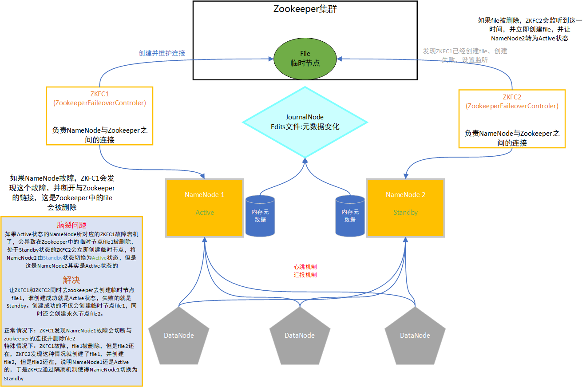

# Bigdata Summary

[TOC]

## Zookeeper

### 功能及应用场景

- 应用场景

  - 分布式锁
  - 命名服务
  - 选举机制
  - 共享存储
  - ……

- 功能

  - 实现分布式多台机器之间的共享存储

    - 将所有机器需要共享的数据存储在Zookeeper中
    - 小数据

  - 利用zookeeper实现辅助选举

    - 让两个主节点到zookeeper中创建一个节点【文件】

    - 谁创建成功谁就是工作状态的(Active)

      - node1：Active工作
        - node1宕机了
      - node2：Standby备份
        - node2会监听这个文件
        - 如果这个文件消失了，说明node1的服务故障了
        - node2会创建这个文件，node2成为active的
      - Zookeeper：file

    - 先到先得

- 本质：Zookeeper就是非常特殊的文件系统

  - 使用：创建、删除、查看、修改

  - 特点

    - 临时节点【文件/目录】：会随着创建的客户端的消失而自动删除
    - 监听机制：允许客户端监听zookeeper中的节点

### 概念

- 节点
  - 代表一个服务或者一台机器
  - 代表Zookeeper中的节点[文件或目录]
- Zookeeper中的节点：Znode
  - 可以代表一台Zookeeper集群中的机器：用于zookeeper集群服务
- Zookeeper：**一种特殊的文件系统**
  - 正常的文件系统
    - 文件是文件，目录是目录
    - 文件不能有下一级，目录可以有下一级
  - Zookeeper文件系统
    - 节点具有文件和目录的共同特征
    - 既可以存储文件也可以拥有子节点

### 架构

- 分布式主从架构：**公平节点**
  - 所有节点都能接收客户端请求，所有节点存储的数据都是一致的，任何一台ZK宕机，其他的ZK机器照样能对外继续提供服务
  - 任何一台Follower都能够参加选举成为Leader
- 主：Leader
  - 接收和处理客户端读写请求
    - 写请求会**广播**给每一台Follower，保证每台ZK的数据存储都是一致的
- 从：Follower
  - 接收读写请求
    - 读请求自己直接处理
    - 写请求要转发给老大（Leader）处理
  - 参加选举，成为Leader的继任者
  - 注意：Observer是一种特殊的从节点
    - 与Follower的区别在于：不能参加选举，只能提供读服务
    - 应用场景：
      - 由于读取数据的并发量巨大，ZK的机器个数少了会导致请求较慢，此时应构建多台ZK
        - 一台为Leader
        - 场景一：如果其他都为Follower，选举会变慢，影响业务
        - 场景二：4台为Follower，5台为Observer

### 设计思想

> 通过一个分布式的共享存储来解决分布式所存在的问题

- 问题1：Zookeeper自己通过共享存储解决分布式存在的问题，如何保障自己挂掉了也能继续对外提供服务？

  - Zookeeper本身就是分布式架构，内部有多台机器，每个机器都是一个节点，他们之间是**公平**的，即**公平节点**
  - 每台机器存储的内容都一致，任何一台挂了，其他的兄弟仍然可以提供相同服务

- 问题2：既然有那么多公平节点，客户端访问任何一个节点，对其写入数据，怎么能保证其他节点的数据一致呢？

  - 为解决此问题，Zookeeper使用了主从架构：

    - 主：
      - 接收和处理客户端的请求（读和写请求）
      - 将写入的信息广播给其他节点实现同步（如有A、B、C三个节点，A节点接收和处理了客户端的写请求，在A写完成之后将数据广播给B、C，B、C再写入该数据，这样三个节点的数据就同步了，在此A为Leader，B、C分别为Follower）
    - 从：
      - 接收和处理客户端的**读请求**
      - 接收写请求，会将写请求转发给主节点（Leader）

    > 注意：客户端并不知道众节点孰是Leader孰是Follower，但是Zookeeper内部是知道孰是老大的，所以客户端只是一个请求发过去，老大收到请求老大就直接处理，如果是小弟们接收到了，小弟们就将请求转发给老大处理。

- 问题3：如果老大（Leader）挂了怎么办？

  - 如果Leader节点发生故障，剩余的所有Follower会发起投票，选举产生一个新的Leader

  - 选举：

    - 辅助选举：帮助别的分布式系统进行选举
      - 两个主节点
      - 通过创建文件，决定谁是Active，谁是Standby
    - 自己选举

    > 这个时候小弟们就争着当老大（公平节点），但是不能打架，毕竟文明社会，众小弟发起投票（选举）

### 选举机制

#### 辅助选举

- zookeeper帮别的分布式框架在两个主节点之间选择一个工作的一个备份的
- **方式一**：两个主节点A、B同时向zookeeper创建同一个临时节点(只有一个能创建成功)
  - 临时节点会随着创建者的消失而消失
  - A创建成功了，A就是工作状态的主节点
  - B创建失败就是备份状态Standby，B要监控这个临时节点(**设置监听**)
    - 如果临时节点消失，说明A出现了问题
    - B会创建这个临时节点，B的状态切换为Active
- 方式二：两个主节点A、B都向zookeeper创建同一个临时顺序节点，两个都能创建成功
  - 临时顺序：谁先创建成功，谁的编号就小
  - 谁的编号小谁就是Active，剩余的是Standby

#### ZK选举

- zookeeper自己内部选择leader

- 三台zookeeper

  - 一台leader
  - 两台follower

- 选举规则

  - zxid：最新的数据id

    - 越新的数据，id越大

  - myid：权重id

    - 自己指定

      ~~~shell
      # 集群中机器.权重 =机器名称.选举端口:同步端口
      server.1=node1:2888:3888
      server.2=node2:2888:3888
      server.3=node3:2888:3888
      ~~~

    - 记录每台机器初始的权重，存储在dataDir下

  - 规则：先判断zxid，如果zxid相同，再判断myid

    - 越大越优先

  - 情况1：刚搭建第一次启动

    - 所有节点的zxid都为0，不比较zxid
    - 先启动第一台机器：第一台给自己投票（1票，myid=1）
    - 启动第二台机器：第二台机器给自己投票（1票，myid=2）
    - 第一台机器会改投第二台，第二胎机器有2票，投票超过半数
    - 第二台机器成为leader

  - 情况2：leader故障，剩余的follower重新选举新的leader

    - 机器情况:
      - node1：follower
      - node2：follower
      - node3：leader
      - node4：follower
      - node5：follower
    - 写入数据：leader来广播
      - 客户端发起写入请求:4
      - 不论请求哪一台，这个请求都由node3来执行
      - node3进行广播，超过半数的机器写入成功，就会返回成功了
        - 这样设计的原因：块
        - 超过半数的机器写入成功，说明只要zookeeper集群可用，数据就正常
      - 极端情况：刚超过半数，leader宕机
        - 所有的follower重新选举
        - 先比较zxid，谁的数据就越全，谁就会优先成为leader
        - 如果zxid相同，就比较myid
        - node2成为新的leader，会将数据广播给所有的follower

### Zookeeper基本使用

- Zookeeper文件系统类似于Linux，树形结构，只能使用绝对路径访问，每个节点的存储内容大小不能超过1MB

- 启动服务端

  ~~~shell
  cd /export/servers/zookeeper-3.4.6/
  bin/zkServer.sh start
  ~~~

- 查看状态

  ~~~shell
  bin/zkServer.sh status
  ~~~

- 关闭服务

  ~~~shell
  bin/zkServer.sh stop
  ~~~

- 客户端连接服务端

  ~~~sehll
  bin/zkCli.sh -server hostname:port
  # 连接多台
  bin/zkCli.sh -server node1:2181,node2:2181,node3:2181
  ~~~

- 列举：只能使用绝对路径

  ~~~shell
  ls  path [watch]
  
  ls  /
  ~~~

- 创建

  ~~~shell
  create [-s] [-e] path data
  create /itcast hadoop
  ~~~

- 读取节点

  ~~~shell
  get path [watch]
  
  get /itcast
  ~~~

- 修改节点

  ~~~shell
  set path data [version]
  
  set /itcast  spark
  ~~~

- 删除节点

  ~~~shell
  rmr path
  
  rmr /itcast/heima
  ~~~

- 退出客户端

  ~~~shell
  quit
  ~~~

  

## Hadoop

> 大数据生态系统

### 功能及应用场景

- 功能：
  - 解决大数据存储问题
  - 解决大数据计算问题
- 包含的模块及功能：
  - **Hadoop common**：连接的通用组件，基本的框架组件，用于连接各个模块和其他框架
  - **Hadoop Distributed File System(HDFS)**：
    - [HDFS](#HDFS)：用于解决大数据存储的组件
    - 定义：**分布式文件系统**
      - 文件系统：对外提供文件的读写
  - **Hadoop YARN**：
    - [YARN](#yarn) ：搭配MapReduce等分布式计算模型解决大数据计算问题
    - 定义：**分布式计算平台**
      - 分布式的任务调度及资源管理平台
  - **Hadoop MapReduce**：
    - [MapReduce](#MapReduce)：搭配yarn等分布式资源管理平台解决大数据计算问题
    - 定义：**分布式编程模型**
      - 是一套分布式编程的API
      - 利用MapReduce的API将普通的代码逻辑编程一个分布式应用程序
- 应用场景：
  - 离线的大数据存储和计算

### **HDFS**

> 定义：分布式文件系统

#### 介绍（功能）

- HDFS定义：分布式文件系统
  - 是文件系统：用来存储文件，离线持久化大数据存储
  - 分布式：将多态机器的资源进行整合，构建一个整体，对外提供统一的分布式服务
  - 分布式文件系统：
    - 对外提供统一的文件系统的服务（[如何读写的？](#读写流程)）
    - **写**：往HDFS中写入数据，实际上是将数据写入了集群中多台机器的文件系统中
      - 这其中必然存在一个分的过程（[如何拆分？](#分块机制)）
      - 将一个大的文件拆分成若干个小的部分，这些小的部分是实际存储在多台机器中的文件系统中的
    - **读**：当初在存的时候，HDFS内部记录了若干个小的部分分别被存在了哪些机器中，该记录即是元数据，在读的过程中，HDFS通过元数据找到这若干个小的部分，将这些部分合并返还给用户

#### 本质

将多台机器的文件系统在逻辑上合并成一个整体，对外则是提供统一的文件存储服务

#### 架构

##### 主从架构

- 主：NameNode
  - 接收客户端读写请求
  - 管理
    - 从节点的健康状态
      - **心跳机制**，每隔一段时间，所有的DataNode都会向NameNode汇报一次心跳
    - 管理数据的安全
      - **汇报机制**，每隔一段时间，所有的DataNode都会向NameNode汇报自己当前所存储所有块的信息
      - NameNode将DN汇报的信息与元数据进行比较，**校验**数据的丢失情况
    - 管理元数据：元数据记录了每个文件对应的所有的小的部分存储的位置
      - NameNode启动时会将磁盘中的元数据加载到内存中
      - SecondaryNameNode：辅助NameNode实现本地元数据文件与元数据变化合并的
- 从：DataNode
  - 每个DataNode负责管理自己所在机器的文件系统
  - 接收客户端的指令，处理读写请求

#### 读写流程

##### 写：

- 1-客户端会请求NameNode写入HDFS，NameNode会验证请求是否合法，返回结果

  - 目标路径是否存在
  - 有没有写入的权限等
  - ……

- 2-NameNode返回对应的结果，构建这个文件的元数据：并没有跟块关联

- 3-客户端提交第一个块的写入请求给NameNode

- 4-NameNode根据每个DN的健康状态以及负载情况返回三台DataNode 地址

  - 基本规则：三台机器的顺序是以离客户端所在机器由近到远

    ```
    node1
    node2
    node3
    ```

  - 根据机架感知计算DN离客户端的远近

  - 机架分配规则

    - 第一份会存储在与客户端机器相同的机架中的一台机器上
    - 第二份会在另外一个机架中
    - 第三份与第二份同机架

  - 5-客户端得到要写入数据块的三台DN地址，客户端会连接第一台【离它最近的那台】，提交写入

  - 6-三台DN构建一个数据传输的管道

  - 7-客户端将这个块拆分成多个packet【64k】，挨个发送个最近的这台DN1

    - DN1会将这个包发送给DN2
    - DN2会将这个包发送给DN3

  - 8-逐级返回写入成功的ack确认码，表示这个包写入完成

  - 9-不断发送下一个包，直到整个块写入完成，返回给NameNode，关联元数据

  - 重复3提交下一个块写入

##### 读：

- 客户端提交读取请求给NameNode
- NameNode会验证这个请求是否合法，如果合法，会查询元数据
  - 返回这个文件每个块对应 的所有存储地址
  - BLk1：node1,node2,node3
  - BLk2：node2,node3,node4
  - BLK3：node3,node4,node1
- 客户端拿到列表，会根据机架感知从每个 块的列表中，选择离自己最近的节点去请求读取
  - BLk1：node3
  - BLk2：node4
  - BLK3：node4
- 客户端会将所有块进行合并返回给用户

#### 应用场景

> 离线的大数据量文件存储

- 离线：按照时间为单位处理数据
- HDFS：基于磁盘分布式文件存储
- 主要场景：一次写入，多次读取
  - 一般是做归档
- 不适合实时，频繁修改或者删除

#### 实现逻辑

##### 分块机制

决定了写入HDFS的文件如何被拆分

- 解决了HDFS如何实现分布式存储的问题

- 规则：文件大于128M就会按照128M拆分，讲一个大文件拆分成若干小块，每128M一个块，不足128M按照实际大小存储

- 按照128M大小进行拆分文件是依据配置文件来的

  ~~~xml
  <property>
  	<name>dfs.blocksize</name>
  	<value>134217728</value>
  </property>
  ~~~

- 副本机制：HDFS会为每个块构建副本存储

  - 解决了分布式架构中单机故障导致数据丢失的问题

  - 将每个块做多个备份存储，如果机器宕机，数据丢失，仍然有备份的数据可以使用（存储在不同的机器中）

  - 副本个数一般不会超过机器个数

  - 默认配置：每个块总共存储3份

    ~~~xml
    <property>
    	<name>dfs.replication</name>
    	<value>3</value>
    </property>
    ~~~

#### **数据安全**

- 问题：如果某台机器故障，数据怎么保证不丢失？

  - HDFS通过副本机制来解决
  - 数据冗余保障机制

- 问题2：如果有数据丢失，怎么及时发现以及解决？

  - **汇报机制**：NameNode及时的发现数据的丢失情况

    - 当丢失比例达到0.001%，就会自动进入安全模式
    - 等待数据块的恢复
    - 直到数据块的比例高于阈值，自动退出安全模式

    > 如果数据不可回复，会一直出于安全模式

- 问题3：如果硬盘损坏怎么办？

  - HDFS有副本机制以及会恢复丢失的数据
  - 注意：HDFS数据存储目录配置可以有多个的

#### **元数据安全**

- 管理
  - NameNode管理元数据，因为NameNode接受客户端请求，需要读写元数据
- 产生
  - 第一次启动之前，在NameNode节点上做了格式化，初始化了空的元数据文件
    - fsimage
    - 存储：dfs.namenode.name.dir
  - 以后每次NameNode启动，都会将元数据文件的内容加载到内存中
    - 加快访问元数据的读写速度提高文件的读写速度
- 写入
  - 每次提交写入【写入、修改、删除】请求给NameNode，NameNode记录新的元数据到内存中
- 问题
  - 由于每次元数据的变化都是在内存中发生改变，本地元数据文件fsimage文件没有个改变
  - 如果NameNode故障，内存中元数据丢失，所有元数据变化都丢失了，只能重新加载之前的元数据文件
    - 问题1：NameNode下一次启动怎么获取最新的元数据？
    - 解决：将内存中的元数据变化写入edits文件，当NameNode重新启动时，会将edits文件与原先的fsimage文件合并，得到关闭之前最新的元数据
    - 问题2：NameNode 运行一年了，元数据变化非常多，edits文件非常大，要实现合并，NameNode非常吃力，启动非常慢
    - 解决：通过SecondaryNameNode 实现辅助同步内存元数据与本地元数据
      - fsimage：本地元数据文件
      - edits：内存元数据 的变化
      - SecondaryNameNode：**定期的将当前的edits与fsimage合并，生成一个新的fsimage文件**
        - 触发合并条件
          - 1小时：定期
          - 按照edits文件大小：64M
        - 一旦合并以后，老的fsimage和edits文件将不再被使用
        - 除了 生成了新的fsimage，也会有新的edits文件
      - NameNode重新启动，只要加载最新的edits和fsimage即可
  - SecondaryNameNode
    - 功能：**辅助实现NameNode元数据合并，加快NameNode的启动速度**

### HA

> High Availablility





#### 基本使用

- 第一种：单个进程启动：有些特殊场景下会用，一般用的比较少

  - HDFS进程

    ```
    hadoop-deamon.sh start 进程名称
    ```

  - YARN进程

    ```
    yarn-deamon.sh start 进程名称
    ```

    

- 第二种：分类启动：工作时主要使用的方式

  - 启动和关闭hdfs：只能在NameNode所在的机器运行

    ```
    start-dfs.sh
    stop-dfs.sh
    ```

  - 启动和关闭yarn：只能在ResourceManager所在的机器运行

    ```
    start-yarn.sh
    stop-yarn.sh
    ```

- 第三种：启动所有进程：不用

  ~~~shell
  start-all.sh
  stop-all.sh
  ~~~

  

### MapReduce

> 主要用MapReduce2.x版本

#### 功能

- 提供分布式计算服务：
  - 分布式程序：
    - 使用MapReduce的API来编程，并不是需要将程序分开，而只要在代码中给定处理的逻辑
    - MapReduce底层会自动将业务拆分成多个小的业务逻辑
  - 分布式环境
    - 多台部署了环境的机器

### yarn

> 定义：分布式资源管理和任务调度框架

#### 介绍

- yarn其实是一个**分布式的资源容器**：将多台机器的硬件资源进行整合，构建一个整体，对外提供统一的资源服务
- 本质：整合多台机器的CPU和内存，搭建一个资源容器，用来盛放（**运行**）分布式程序
  - yarn根据程序中指定的逻辑，底层自动将程序拆分成多个小的任务
  - 每个小的任务交由不同机器去执行

#### 架构

- 分布式主从架构
  - 主：ResourceManager管理节点
    - 接收客户端的请求
    - 管理
      - 管理从节点
      - 任务管理分配
      - 集群资源管理和任务调度
  - 从：NodeManager计算节点
    - 专门负责管理自己所在的机器上的CPU和内存资源
    - 接收任务，使用CPU和内存来执行任务（**计算**）


