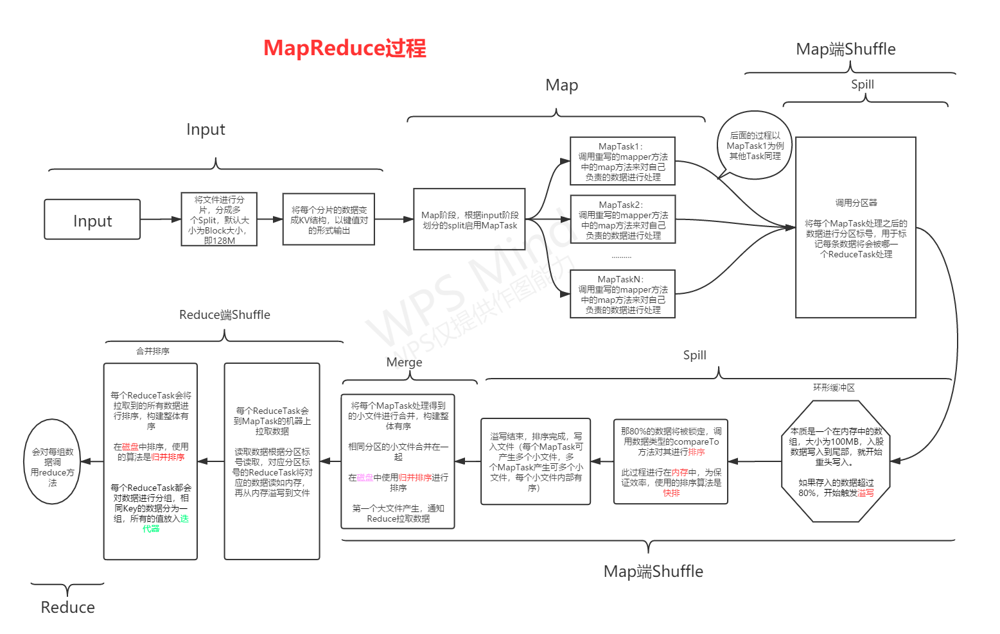

# MapReduce

[TOC]

## 脑裂问题

### 形成

- 如果Active的ZKFC故障，导致ZK中的临时节点file1被删除
- Standby的ZKFC发现file1被删除，认为active的NN1故障了，于是standby的ZKFC创建了file1
- 并且NN2转换为active状态，其实NN1也是active

### 解决

- 让ZKFC1和ZKFC2同时创建一个一个临时节点file1，谁创建成功就是active，否则是standby
  - 假设zkfc1是active，zkfc2为standby
  - zkfc1除了创建临时节点file1之外创建成功之后还会创建永久节点file2

- 正常情况下：
  - zkfc1发现NN1故障，zkfc1会主动地断开与zookeeper的链接，并且会自动删除file2
  - 这是file1和file2都被删除了，zkfc2发现file1没了，重新创建，NN2成为active
- 特殊情况下：
  - zkfc1故障，但是NN1还是active，file1消失了，但是file2仍然存在
  - zkfc2发现file1消失了，于是去创建file1，并且还需要创建file2，但是发现file2还在
    - 说明NN1没有故障，还是active
    - 但是NN2也已经成为active，ZKFC2会通过隔离机制杀死NN1

# MapReduce

## 编程模型

### 功能

- 用于开发分布式程序，本身是一套已经开发封装好的分布式编程的API
- 根据用户定义的数据处理逻辑，自动将这个逻辑拆分成多个小的任务逻辑
- 在分布式运行环境中，会将每个小的任务在不同的计算节点上运行

### 思想

- 分而治之
- 讲一个大的处理逻辑，拆分成多个小的处理逻辑

### 应用场景

- 用于开发离线的分布式程序，对时效性要求不高的场景

- 时效性：分钟级别

### 阶段

- 正常的数据处理的阶段划分：
  - 读取数据：将数据读取到程序
  - 处理数据：将读取到的数据进行处理，得到结果
  - 输出结果：将结果进行保存
- **MapReduce的五大阶段**
  - Input：负责整个分布式程序的数据的输入
    - 默认输入类：TextInputFormat
    - 方法：setInputPath(path)
    - 默认读取的Path：由fs.defaultFS决定
      - 集群中默认读取HDFS
  - **Map**：**分**的过程，启动多个Map Task进程来处理每个Task
    - 处理逻辑：由Map方法决定
      - map方法会将input读取到的数据进行处理
      - 至于如何处理，这由自己定义的代码逻辑决定
  - **Shuffle**：默认提供的功能有分组和排序
    - 对Map阶段输出的数据进行分组和排序
  - **Reduce**：**合**的过程，默认启动一个Reduce Task进程将上面的结果进行合并
    - 处理逻辑：由reduce方法决定
      - reduce方法会将上一步的数据进行聚合处理
      - 至于如何聚合，这由自己的定义的代码逻辑决定
  - Output：整个分布式程序结果的输出
    - 默认输入类：TextOutputFormat
    - 方法：setOutputPath(path)
    - 默认写入的Path：由fs.defaultFS决定
      - 集群中默认写入HDFS

## 编程规则

### Driver类

- 包含main方法的类，用于运行程序

  - 作为程序的入口
  - 负责调用run方法

- 官方推荐规则：让此类继承Configured，实现Tool接口

  ~~~java
  public class Driver extends Configured implements Tool
  ~~~

  - 重写方法：run方法
    - 用于构建、配置、提交MapReduce的程序

### Input类

- MapReduce提供了多种输入的类，主要负责读取数据到MapReduce程序中
- **默认**输入类：TextInputFormat
  - 用于读取文件
  - 将文件的每一行准换为一个KV结构
  - K：行的偏移量
  - V：行的内容

### Mapper类

- Map阶段中每个MapTask需要实例化一个Mapper类
- 将自己负责处理的数据调用Mapper类中的map方法来进行处理
  - 每条KV调用一次map方法
- 规则：继承mapper类
  - 重写map方法

### Reducer类

- Reduce阶段中每个ReduceTask需要实例化一个Reduce类
- 将自己负责处理的每一组数据调用Reduce类中reduce方法来进行处理
- 规则：继承Reduce类
  - 重写reduce方法

### Output类

- 默认输出类：TextOutputFormat

### 数据结构

整个MapReduce中所有的数据都以KV形式存在

### 数据类型

不能直接使用java类型，使用Hadoop封装好的序列化类型

~~~java
int 	intWritable
String  Test
double  DoubleWritable    
null 	NullWritable
...    
~~~

- 为什么要这样封装？
  - Hadoop对java中的类型进行了封装，实现了序列化
  - 序列化：
    - 两台机器之间需要传输数据
    - 传输数据：直接发送即可
    - 传输对象：必须经过序列化
      - 序列化：把对象封装成数据进行传输
      - 反序列化：把数据解析成对象

## 编程模板

## MR程序历史监控

### 问题

- 提交到yarn运行的程序，一旦yarn重启就看不到了
- lLinux上通过yarn运行程序，运行失败没有明显的日志

### JobHistoryServer

- MapReduce专门设计的一个进程jobhistoryserver用于记录在yarn上运行的MapReduce的程序，并关联对应的日志
- 可以方便用户查看之前运行的程序的详细信息

### yarn日志聚集

- 日志聚集：将yarn运行的所有程序的日志存储在HDFS上，进行统一的存储
- 一般搭配JobHistoryServer使用，用来通过其访问程序的运行日志
- 配置yarn-site.xml

### 启动

- 先启动HDFS 

- 再启动JobHistoryServer

  - 在node2启动

    ~~~shell
    sbin/mr-jobhistory-daemon.sh start historyserver
    ~~~

  - 开放端口

    ~~~shell
    http://192.168.88.222:19888/jobhistory
    ~~~

    

## 分区与自定义分区

### 问题

- MapReduce编程：开发分布式程序，解决数据量过大，机器资源不足或者性能差的问题
- 解决：
  - input：会将处理的大量数据分成若干个部分，分片：split
  - 分片规则：getSplit()方法
  - Map：一个分片=启动一个MapTask进程来处理
  - Shuffle
    - 分组
    - 排序
    - 没有改变数据
    - 输出
  - Reduce：默认启动一个ReduceTask进程
    - 一个进程处理所有的数据
    - （数据量过大，负载过高，性能低，速度低）

### 分区

- 应用场景：Reduce处理的数据量非常高，影响性能，并且不影响结果的使用

- 可以指定在Reduce阶段，配置启动多个Reduce
  - 为了避免单个Reduce负载过高，影响性能
  - 优点：程序Reduce阶段也是分布式执行的，更快的
  - 缺点：一个ReduceTask进程会产生一个结果文件，最终会有多个结果文件
- 本质：在Shuffle阶段会对每条K2 V2进行计算，得到这条K2 V2会被哪个Reduce进行处理
  - 打标签，标记每条数据会被哪个ReduceTask处理
  - **一个Reduce对应于一个分区**
  - 默认只有一个分区
- 分区规则
  - 默认规则：按照K2的Hash取余得到Reduce的个数/分区的个数
    - 分区类的决定：默认的分区类：HashPartitioner
    - 方法：getPartition(K2, V2, NumberOfReduce)
    - 规则优点：只要K2相同，就会进入同一个Reduce
    - 规则缺点：负载不均衡造成**数据倾斜**

### 自定义分区

- 需求：默认的Hash分区存在数据分配不均匀的问题，需要根据自己的需求决定分区的规则

- 只要Reduce个数超过1个，在Shuffle阶段，对每个Map输出的K2 V2 都会调用getPartition方法，实现分区，决定了每条KV最终会被哪个Reduce处理

- **如何自定义分区**：
  
  - 开发一个**分区器**：继承Partitioner类
  - 重写getPartition方法
    - getPartition方法需要三个参数分别是分别是K2,V2,和numReduce(int类型)
    - K2 和V2分别是Map阶段的输出
    - numRduce表示调用第几个Reduce
    - numRduce的参数大小与`job.setNumReduceTasks(N);`设置的个数有关
  
- 实现示例：构建两个分区，浦东地区放入一个Reduce处理，其他的放入其他Reduce处理

  ~~~java
  //设置两个reduce,编号分别为0和1
  job.setNumReduceTasks(2);
  
  /**
   * @ClassName: UserPartition
   * @Author: Roohom
   * @Function: 自定义分区器
   * @Date: 2020/8/24 12:22
   * @Software: IntelliJ IDEA
   */
  public class UserPartition extends Partitioner<Test, IntWritable> {
      String houseSource = "浦东";
      /**
       * Map阶段输出的每一条K2V2都会调用一次这个方法用于标记会被哪个reduce处理
       *
       * @param key         当前的K2
       * @param intWritable 当前的V2
       * @param i           是第几个Reduce
       * @return 是否为浦东的标记
       */
      @Override
      public int getPartition(Test key, IntWritable intWritable, int i) {
          String region = key.toString();
          if (houseSource.equals(region)) {
              return 0;
          } else {
              //不是浦东的返回1
              return 1;
          }
      }
  }
  ~~~

  

## 自定义数据类型

### 自带数据类型

- 只能使用Hadoop中的类型，不能使用普通的Java类型
- Hadoop类型实现了序列化
- 自带的数据类型
  - Test
  - IntWritable
  - LongWritable
  - DoubkeWritable
  - ByteWritable
  - BooleanWritable
  - NullWritable
  - ...

### 自定义数据类型

- Hadoop中提供了自己封装的Java bean的接口

- 规则：

  - 必须实现Writable接口

  - 重写方法

    - 定义属性
    - 无参构造
    - getter and setter
    - toString
    - write：序列化
    - readFields：反序列化

    > 注意：序列化和反序列化的顺序必须一致

## 分类与排序

### MapReduce程序分类

- 五大阶段

  - Input，Map，Shuffle，Reduce，Output
  - Shuffle：排序
    - 其本质是作比较，数据量特别大的情况下耗时耗资源
    - 如果不需要应该被省去
  - 适合场景：**做分组聚合**

- 三大阶段：

  - input，Map，output

  - 适合场景：**不需要做分组聚合**，一般是一对一的场景

    - ETL：数据清洗
      - 过滤：将不合法的数据，以及不需要的数据过滤
      - 转换：将原始数据格式转换为目标格式
      - 补全：将需要用到的数据补全(IP->国家、省份、城市->经纬度)

  - 如何实现：

    - 设置Reduce的个数为0，Map的结果就是最后的结果

      ~~~java
      job.setNumReduceTasks(0);
      ~~~

      

### 排序

#### 排序方式一

- MapReduce的Shuffle过程中：会对Map输出的K2进行排序
  - 会构建一个集合，将K2类型强转为一个排序类[比较器类]的对象，放入集合，用于排序
    - **Hadoop中的所有类型，如果要作为Map输出的K2,经过shuffle，必须实现WritableComparable接口**
      - 成为比较器的子类，重写一个比较器compare方法，能实现转换
      - 在排序时，会调用这个对象的compareTo方法来实现同对象之间的比较
  - 自定义数据类型：
    - 实现Writable
      - 三大阶段中Map输出的Key
      - Map输出的key
      - Reduce输出的Key
      - Reduce输出的Value
    - 实现WritableComparable
      - Map输出的key
      - Map输出的Value
      - Reduce输出的Key
      - Reduce输出的Value
- 关键之处：
  - **如果自定义的数据类型作为Map阶段输出的k2，就必须实现WritableComparable接口**

#### 排序方式二

- Shuffle中可以自定义排序器
  - 默认：Shuffle中排序是调用K2自带的compareTo方法来实现排序
    - 如果是自定义数据类型，直接在compareTo中方法中控制排序规则（`return`后加负号即可）
    - 如果是官方自带的类型，默认都是升序的
- 需求：希望使用官方自带的类型，但变成降序的结果
- 实现：自定义排序比较器
  - 注意：**排序比较器的优先级会大于数据类型自带的compareTo**
  - **规则**：
    - 开发一个类，继承WritableComparator
    - 重写一个compareTo方法

#### 对于排序，总的来说

> 在shuflle阶段，Hadoop官方已经规定了会对Map输出的Key进行排序
>
> 一种是官方默认提供的排序，都是升序的
>
> 一种是自定义排序，排序规则由你自己设定
>
> 无论是官方的排序还是自定义排序，都必须实现WritableComparable接口
>
> 这其中分两种情况：
>
> 第一种：对于官方自带的数据类型中的排序，已经实现了WritableComparable接口，并且预先定义了其排序规则，如果你想更改，就必须继承WritableComparator类进而重写compareTo方法，以达到自定义更改排序
>
> 第二种：对于自己定义的数据类型(自定义的Java Bean),是没有排序规则的，而官方要求了你必须实现排序规则，所以必须让该bean实现WritableComparable接口，实现序列化与反序列化，并且重写compareTo方法

- shuffle阶段：会对Map输出的Key进行排序
  - 默认：会调用这个key自带的compareTo方法
    - 自定义类型/Hadoop自带的类型 -> 实现WritableComparable接口
    - 自定义类型：自己控制排序规则
    - Hadoop自带类型：都是升序的
  - 自定义排序规则：优先级大于默认规则
    - 构造一个排序比较器
      - 继承WritableComparator类
      - 重写compareTo方法

## Shuffle过程

### 功能

- 分区：如果有多个Reduce，决定当前的每条数据会进入哪个Reduce进而被处理
- 排序：调用了数据类型自带的conpareTo方法
- 分组：按照K2进行分组

#### 过程

### Shuffle中的优化

#### Combiner

Map端的聚合，为Reduce减负

- 用于优化MapReduce中Shuffle过程，减轻Reduce负载，默认是不开启的

- 不是所有的程序都可以使用Combiner

- 开启（一般就是Reducer类）

  ~~~java
  job.setCombiner(CombinerClass.class)
  ~~~

- 被调用的位置：

  - Map端的Shuffle过程
    - Spill：内存中会进行排序，准备溢写，在溢写之前，如果开启了Combiner，先聚合后溢写
    - Merge：每个MapTask会将所有的小文件进行合并并排序，如果开启Combiner，会先聚合
  - Reduce端Shuffle：
    - Merge：调用一次Combiner

#### Compress

应用：减少磁盘和网络IO

