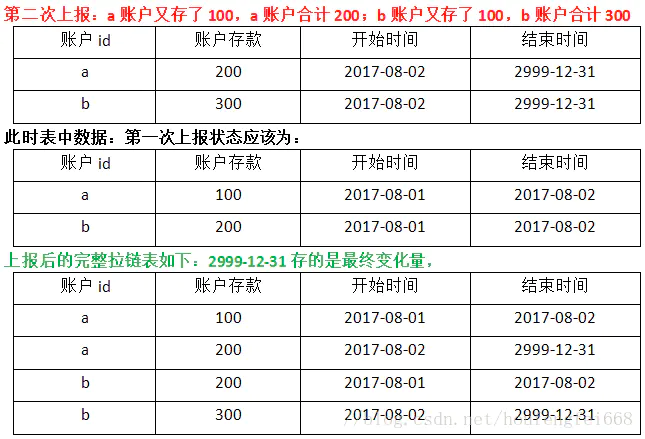

# SCD

***Slowly Changing Dimensions (SCD)*** are dimensions that have data that slowly changes.

**缓慢变化维:**数据会发生缓慢变化的维度就叫”缓慢变化维”。

## SCD的三种形式

- **SCD1： 保留最新状态**
  - **缺点：**没有任何历史状态，历史发生的事情无法追溯，企业中不关心历史状态的数据，可以使用SCD1

- **SCD2 ：用不同的时间来标记不同的状态**
- **SCD3：根据不同的状态，增加对应的列**


# 拉链表

> 参考博文：
>
> 1、[**缓慢变化维解决方案**](https://www.cnblogs.com/xqzt/p/4483152.html)
>
> 2、[**HIVE- SCD缓慢变化**](https://www.cnblogs.com/RzCong/p/10695353.html)

## 何为拉链表？

拉链表1针对数据仓库设计汇总表存储数据的方式而定义的，用来记录数据历史。记录一个事物从开始一直到当前状态的所有变化的信息。

## 使用场景？

- 有一些**表的数据量很大**，比如一张用户表，大约10亿条记录，50个字段，这种表，即使使用ORC压缩，单张表的存储也会超过100G，在HDFS使用双备份或者三备份的话就更大一些。

- 表中的**部分字段会被update更新操作**，如用户联系方式，产品的描述信息，订单的状态等等。

- **需要查看某一个时间点或者时间段的历史快照信息**，比如，查看某一个订单在历史某一个时间点的状态。

- 表中的**记录变化的比例和频率不是很大**，比如，总共有10亿的用户，每天新增和发生变化的有200万左右，变化的比例占的很小。

### 不使用拉链表还可以有两种方法存储数据：

SCD1：只保留最新的一份数据，用当前状态覆盖原有的状态

SCD3：每天保留一份全量的数据切片，此种方式存储空间占用量大，无法确定数据生命周期，保留多少份全量无法控制

## 拉链表过程？

数据变更历史如下（图片来自于[@[analanxingde](https://www.jianshu.com/u/38e7cb1ae20a)]）：





注意：

- **开始结束时间**表示该条记录的生命周期时间

- 结束时间为 ‘2999-12-31’表示该条记录目前处于有效状态。

- 如果查询当前所有有效的记录，则`select * from user where end_date = ‘2999-12-31’`

- 如果查询2017-08-01的历史快照，则select * from user where start_date <= ‘2017-08-01’ and t_end_date >= ‘2017-08-01。


## 实现流程

- step1：先增量采集所有更新和新增的数据到Hive中的update表中

  - 第一张表：update表：存储最新的数据

    ```
    #这是更新的数据
    order001	zhangsan	   火箭	   2020-01-01     	 退款	    2020-01-02		9999-12-31
    #这是新增的数据
    order002	lisi		   装甲车	  2020-01-02		支付成功	2020-01-02    9999-12-31
    ```

  - 当前数据仓库中的数据：dw

    ```
    order001	zhangsan	   火箭		  2020-01-01     支付成功	2020-01-01		9999-12-31
    #这是一条老状态的数据
    order003	zhangsan	   火箭		  2020-01-01     支付成功	2019-12-31     2020-01-01
    ```

    

- step2：将两张表【update表，数仓表】的数据合并到一张临时表中

  - tmp表：用于临时的存放update与数仓合并后的结果

  - 难点：这张临时表的构建，构建过程中需要判断当前如果有的数据产生新的状态，老的状态的endtime需要修改

    ```
    select 
    *
    from update
    union all
    select
    	orderid,
    	userid,
    	productid,
    	createTime,
    	status,
    	startTime,
    	if(如果在当前数仓中是最新状态，并且update中出现了更加新的状态，才需要修改，修改为当前的时间)
    from dw
    
    问题：需要知道update中有哪些数据产生了最新的状态
    ```

- step3：将临时表的数据覆盖到数仓表中

  - 数据仓库表：最后存储最终的结果

- 结果：数仓表

  ```
  #这是原始数据
  order001	zhangsan	   火箭		 2020-01-01       支付成功	   2020-01-01	2020-01-02
  #这是更新的数据
  order001	zhangsan	   火箭	     2020-01-01       退款	     2020-01-02   9999-12-31
  #这是新增的数据
  order002	lisi		   装甲车		2020-01-02		 支付成功      2020-01-02   9999-12-31
  ```

  